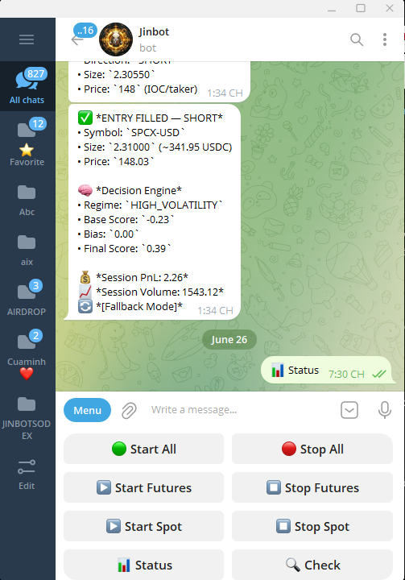
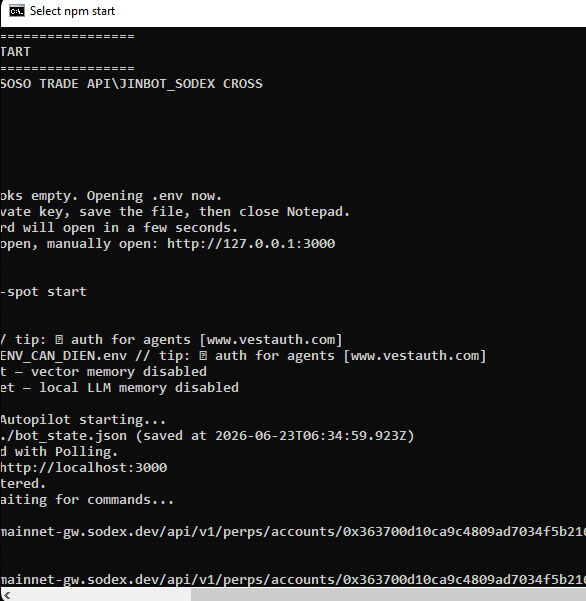
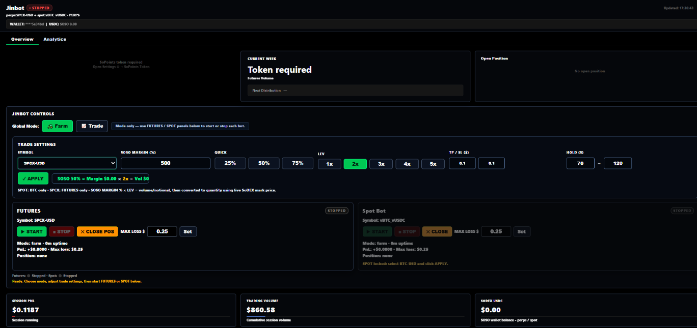

# QuyNhon AI - One-Person On-Chain Finance Operating System

QuyNhon AI is a live-only on-chain finance dashboard built for the SoSoValue 3rd Wave Buildathon on Akindo.

It combines SoSoValue research context, SoDEX market/account/trading APIs, AI-assisted market reports, and a local realtime trading bot control panel into one practical workspace for a solo trader or small on-chain finance operator.

Production demo:

```text
https://jinchain.vercel.app
```

GitHub:

```text
https://github.com/Jinchainne/QuyNhon
```

## Submission Metadata

| Field | Value |
| --- | --- |
| Buildathon | SoSoValue 3rd Wave on Akindo / WaveHack |
| Category | Tools |
| Built with | SoSoValue, SoDEX, ValueChain-ready architecture, AI |
| Tags | SoSoValue, SoDEX, ValueChain, Agentic, One-Person, On-Chain Finance, AI x Web3 |
| Primary user | Solo trader, research operator, or small on-chain finance desk |
| Demo mode | Live data with preview-first trading; live execution is gated |

## Buildathon Fit

The 3rd Wave prompt is about building a one-person on-chain finance business with SoSoValue data, news feeds, index/tools, trading APIs, and high-performance L1 infrastructure.

QuyNhon AI focuses on the operator experience:

- Read live market data and SoSoValue research in one place.
- Convert market context into an AI report for decision support.
- Preview spot/futures orders before submitting.
- Gate live trading behind explicit admin, wallet, and risk controls.
- Control a local realtime SoDEX trading bot without exposing private keys in the browser.

## Judge Demo Path

1. Open `https://jinchain.vercel.app`.
2. Open **API Health** and confirm the configured providers.
3. Open **Market Pulse** to inspect live coin universe, prices, volume, and momentum.
4. Open **News Feed** and **Market Intelligence** to see SoSoValue-powered research context.
5. Open **AI Reports** and generate a market report from live context.
6. Open **Futures Trading** or **Spot Trading**, fill a small order, and click **Preview**.
7. Open **Automation** to see scheduled preview/live workflow controls.
8. Open **Local Trade Bot** to see the bridge panel for the local JINBOT_SODEX CROSS runtime.

For safety, public demos should use preview/paper mode unless the operator intentionally enables live trading and has configured the admin wallet, admin secret, and SoDEX server keys.

## What It Does

### Live Trading Terminal

- Spot and futures-style trading screens.
- Market, limit, stop, and TWAP intent fields.
- Leverage, margin mode, time-in-force, TP, SL, and reduce-only auto-close support.
- Preview route that returns an execution plan before any live submission.
- Live submission route gated by server env, admin secret, connected wallet, and max risk settings.

### SoSoValue Research Desk

- Pulls live SoSoValue research/news feed.
- Combines SoSoValue context with market structure and signal candidates.
- Generates AI reports through an OpenAI-compatible AI router.
- Designed for a judge to see the app's data/API integration quickly, without reading code.

### Signal Engine

- Uses live market data to rank momentum, liquidity, risk, and conviction.
- Shows heatmaps and ranking tables for quick scanning.
- Does not invent prices, wallets, portfolio balances, or news.

### Local Trade Bot Panel

The **Local Trade Bot** menu controls a separate local JINBOT_SODEX CROSS process.

This matters because realtime trading loops, Telegram polling, local logs, and wallet-side automation should run as a long-lived local process, not inside a Vercel serverless function.

Supported controls:

- Start/stop futures bot.
- Start/stop spot bot.
- Start/stop all configured bots.
- Close futures position.
- Read local PnL, events, trades, position data, trade settings, and bot status.

### Realtime Local Runtime Evidence

The local trading layer has been tested as a running desktop process with Telegram controls and a browser dashboard. The screenshots used in the submission show three important proof points:

| Evidence | What it proves |
| --- | --- |
| Telegram bot control menu | The operator can start/stop all bots, start/stop futures, start/stop spot, request status, and check positions from Telegram. A filled short entry on `SPCX-USD` shows the bot producing live execution feedback with session PnL and session volume. |
| Windows terminal runtime | `JINBOT_SODEX CROSS` runs as a long-lived local Node process, opens its `.env`, starts Telegram polling, loads local state, and connects to SoDEX mainnet API endpoints. |
| Local dashboard | The local dashboard exposes trade settings, farm/trade mode, futures/spot controls, max loss, close position, session PnL, trading volume, wallet balance, open position, and bot status. |

If adding the screenshots directly to this repo, save them under:

```text
docs/screenshots/telegram-control.png
docs/screenshots/local-terminal-runtime.png
docs/screenshots/local-dashboard.png
```

Then uncomment or add these Markdown image links:

```md



```

### Jinbot Cross Signals

The **Jinbot Cross Signals** menu is a companion bridge for:

- Local dashboard status.
- Local signals from HTTP endpoints.
- Optional state file reading.
- Optional Telegram command forwarding.

## Architecture

```text
Browser UI
  |
  | Next.js app router
  v
Vercel / Node runtime
  |
  |-- /api/live         -> CoinGecko + SoDEX + SoSoValue aggregate context
  |-- /api/trade        -> terminal data for selected market
  |-- /api/news         -> SoSoValue research/news
  |-- /api/copilot      -> AI report generation
  |-- /api/execution    -> preview/live execution gate
  |-- /api/automation   -> scheduled preview/live execution route
  |-- /api/jinbot       -> local bot bridge or Telegram fallback
  |
  v
External providers
  |-- SoSoValue API
  |-- SoDEX API
  |-- AI router
  |-- Public market data providers

Optional local runtime
  |
  |-- JINBOT_SODEX CROSS local process
  |-- Local dashboard bridge on http://127.0.0.1:8787
  |-- Telegram bot polling
  |-- Local trade logs/state
```

## Data And API Integrations

| Area | Integration | Purpose |
| --- | --- | --- |
| Research | SoSoValue API | News/research context for market intelligence and AI reports |
| Trading | SoDEX API | Account lookup, market data, preview/live order execution path |
| AI | OpenAI-compatible router | Report generation from live context |
| Market context | Public market data providers | Coin universe, prices, order book, candles, trades |
| Local automation | JINBOT_SODEX CROSS | Realtime bot session, Telegram controls, local trade loop |

## Live-Only Rule

The app is intentionally live-only.

If a provider does not return data, the UI shows an unavailable state instead of fake charts, fake prices, fake wallet balances, fake news, or fabricated portfolio data.

This makes the demo less flashy than a mockup, but more honest for judging real product readiness.

## Security Model

Live execution requires all of the following:

- `ENABLE_LIVE_TRADING=true`
- `ADMIN_SECRET` entered in the UI
- connected wallet equals `ADMIN_WALLET`
- SoDEX server credentials are present
- order does not exceed `MAX_ORDER_NOTIONAL_USD`
- futures leverage does not exceed `MAX_LEVERAGE`

Secrets stay server-side:

- private keys are never returned to browser responses
- signatures, nonces, and payload hashes are not exposed
- `.env`, `.env.local`, `.vercel`, and `.local` are ignored
- local bot files and trade logs are not committed

Public buildathon demos should normally keep:

```env
ENABLE_LIVE_TRADING=false
```

## Environment Variables

Use Vercel Environment Variables for production. Do not commit real values.

### Required For Full Demo

```env
SOSOVALUE_API_KEY=

SODEX_API_KEY_NAME=
SODEX_PUBLIC_KEY=
SODEX_API_PRIVATE_KEY=

AI_API_KEY=
AI_BASE_URL=https://router.chainopera.ai/v1
AI_MODEL=Qwen3-32B

NEXT_PUBLIC_APP_URL=https://jinchain.vercel.app
```

### Live Trading Gate

```env
ENABLE_LIVE_TRADING=false
ADMIN_SECRET=
ADMIN_WALLET=
AUTOMATION_SECRET=
MAX_ORDER_NOTIONAL_USD=50
MAX_LEVERAGE=5
```

### Optional Automation Config

```env
AUTO_TRADE_CONFIG={"market":"BTCUSDT","product":"futures","side":"long","orderType":"limit","amount":"0.001","leverage":2,"futuresAutoClose":"time","futuresCloseMinutes":"15","action":"preview"}
```

### Optional Local Bot Bridge

```env
JINBOT_BRIDGE_URL=http://127.0.0.1:8787
JINBOT_BRIDGE_SECRET=
JINBOT_STATE_PATH=
JINBOT_PANEL_SECRET=
JINBOT_TELEGRAM_BOT_TOKEN=
JINBOT_TELEGRAM_CHAT_ID=
```

Aliases supported by the server:

```env
SODEX_PRIVATE_KEY=
SODEX_WALLET_PRIVATE_KEY=
CHAINOPERA_API_KEY=
OPENAI_API_KEY=
JINBOT_LOCAL_URL=
TELEGRAM_BOT_TOKEN=
TELEGRAM_CHAT_ID=
```

Avoid adding unused local-only bot settings to Vercel unless the web app actually reads them. The Next.js app does not need dashboard-only values such as local hold timers, farm TP/SL values, log paths, or bot volume mode flags.

## Local Development

```bash
npm install --legacy-peer-deps
npm run dev
```

Open:

```text
http://localhost:3000
```

Production build:

```bash
npm run build
npm run start
```

## Running The Local Realtime Trade Bot

The realtime trade bot is intentionally a separate local process. Start it only when you want the local automation loop and Telegram polling to run.

```powershell
powershell -ExecutionPolicy Bypass -File scripts\start-jinbot-local.ps1
```

Default archive path used by the script:

```text
E:\TOOL FULL 03-1-2026\SOSO TRADE API\JINBOT_SODEX CROSS.zip
```

The script extracts the bot under `.local`, sets:

```env
DASHBOARD_PORT=8787
JINBOT_BRIDGE_URL=http://127.0.0.1:8787
```

and runs:

```bash
node dist/bot.js
```

When the local bot is running, open **Local Trade Bot** in QuyNhon AI. The panel will read the bridge and enable start/stop/close controls.

Important for Vercel:

- `127.0.0.1` on Vercel is Vercel's server, not your laptop.
- To control a local bot from the deployed website, expose the local dashboard with Cloudflare Tunnel, ngrok, or another secure tunnel.
- Then set `JINBOT_BRIDGE_URL` in Vercel to the public tunnel URL.

## Deployment

Vercel is the recommended deployment target.

```bash
vercel link --project jin
vercel deploy --prod
```

This repo includes:

```text
vercel.json
```

with:

- Next.js framework detection
- build command
- install command using `--legacy-peer-deps`
- optional cron path for automation

If using the cron route, configure `AUTOMATION_SECRET` and avoid hardcoding real secrets into `vercel.json`.

## Verification

Run local build:

```bash
npm run build
```

Check live health:

```bash
curl https://jinchain.vercel.app/api/health
```

Check local bot bridge route:

```bash
curl https://jinchain.vercel.app/api/jinbot
```

Optional live-only verification script:

```bash
npm run verify:live
```

## Project Structure

```text
app/
  api/
    automation/       scheduled preview/live route
    copilot/          AI report generation
    execution/        order preview/live execution gate
    health/           provider/env health report
    jinbot/           local bot / Telegram bridge
    live/             aggregated live market context
    sodex/            SoDEX account and market endpoints
    sosovalue/        SoSoValue news endpoint
  lib/
    providers.ts      provider clients, trading gate, execution helpers
  page.tsx            full dashboard UI
public/               visual assets
scripts/
  start-jinbot-local.ps1
  verify-live-only.mjs
vercel.json
```

## Judging Criteria Mapping

| Criterion | Where to look |
| --- | --- |
| User value and practical impact | One workspace for research, AI report generation, SoDEX preview/live trading, automation, and local bot control |
| Functionality and working demo | Production site, API health, Market Pulse, AI Reports, Trade Ticket, Local Trade Bot |
| Logic, workflow, product design | Live-only rule, explicit preview-first workflow, separate local runtime for realtime bot work |
| Data/API integration | SoSoValue news, SoDEX account/markets/execution, AI router, live market data, Telegram/local bridge |
| UX and clarity | Sidebar modules, command search, risk copy in trade ticket, visible bridge diagnostics |

## Known Limitations

- The local realtime bot must run outside Vercel.
- A deployed Vercel app cannot call a laptop's `127.0.0.1`; use a secure tunnel for remote control.
- Live trading depends on valid SoDEX credentials and the operator intentionally enabling all gates.
- Browser-based auto-close timers require the browser tab to remain open unless moved to a durable queue or cron-backed workflow.

## Roadmap

- Persistent trade history database.
- Secure tunnel onboarding helper for local bot control.
- Better local bot authentication handshake.
- Queue-backed automation jobs.
- Portfolio analytics once wallet/account coverage is expanded.

## License

Buildathon prototype. Keep private keys, exchange credentials, and bot logs out of source control.
